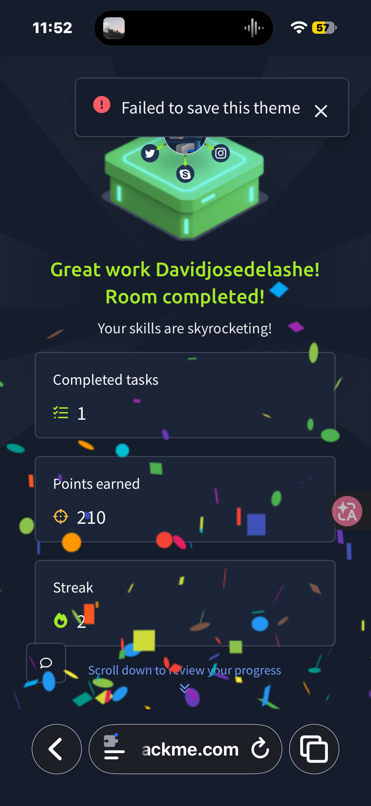
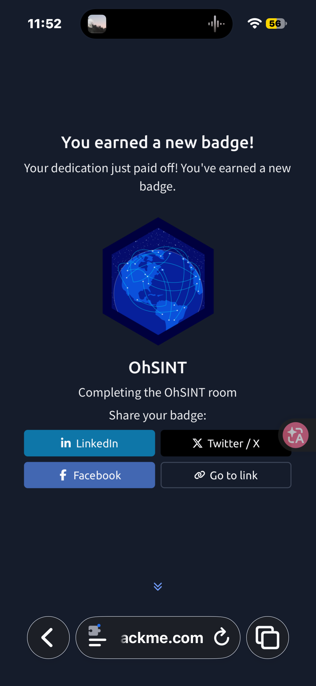

Lab de https://tryhackme.com/room/ohsint
1 Introducción ohsint es un laboratorio de osint
El objetivo es apartir de los metadatos de una foto responder una serie de preguntas
(Investigar una persona o entidad)
2 Herramientas usadas firefox y Safari navegadores y exif tools extractor de metadatos
3 Preguntas y como las solucione
	1.	What is this user’s avatar of? — ¿De qué es el avatar del usuario? Solución buscar el nombre de usuario en Google y sale el gatito pongo cat en el campo
	2.	What city is this person in? — ¿En qué ciudad está esta persona? Busco en internet las coordenadas GPS de la foto ( los metadatos se ven con exif tools)y a partir de ahí con Google maps y Google veo en qué ciudad está
	3.	What is the SSID of the WAP he connected to? — ¿Cuál es el SSID del punto de acceso Wi-Fi al que se conectó?al buscar en Google el nombre de usuario sale una cuenta de x y esa cuenta de x sale la bssid Y como wigle no me dejaba registrarme busque en Google el nombre de ssid
	4.	What is his personal email address? — ¿Cuál es su correo electrónico personal?sale en github del usuario 
	5.	What site did you find his email address on? — ¿En qué sitio encontraste su correo?github
	6.	Where has he gone on holiday? — ¿Dónde se ha ido de vacaciones? Me fijé y las letras coincidían con New York fue cierto 
	7.	What is the person’s password? — ¿Cuál es la contraseña de la persona? Para esto desde el ordenador en el código de la web de wordpress del usuario estaba metida la password ( pero no era visible estuve un buen rato)
4 Técnicas usadas
Análisis de metadatos, investigación de identidad,búsqueda en fuentes,geolocalización,análisis web y investigación
5 Cosas aprendidas Extracción de metadatos, análisis web,una pequeña información puede dar lugar a una gran investigación nadie está a salvo en internet si no limpia sus metadatos antes de subir fotos o vídeos a RRSS
6 Conclusion el lab me ha enseñado técnicas de osint y que hay que borrar metadatos antes de compartir fotos. A partir de una imagen he resuelto 7 preguntas incluyendo coordenadas GPS y avatar y email datos sensibles
7 Evidencia
Capturas que demuestran que he completado el laboratorio OhSINT en TryHackMe.

